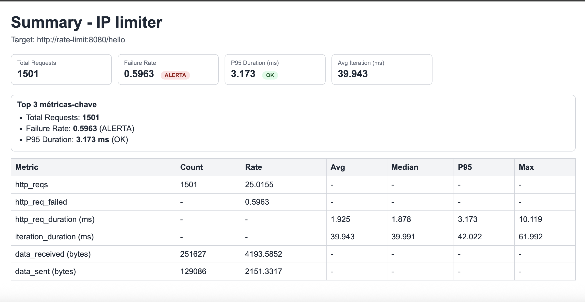
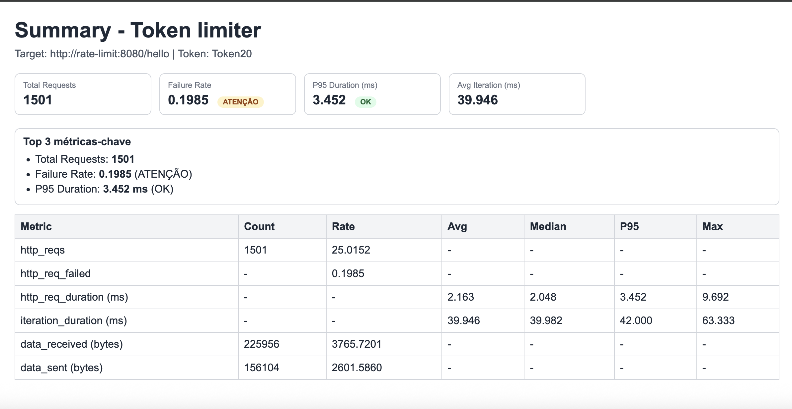

# Go Rate Limiter 🚦

Rate limiter em Go com persistência em Redis, suporte a limite por IP e por token, arquitetura em camadas (app/usecase/domain/ports/adapters) e suíte de testes automatizados.

## Visão Geral

- **Objetivo**: proteger a API de excesso de requisições com resposta HTTP `429`.
- **Critério de limite**:
   - sem token válido: limite padrão por IP;
   - com token válido (`API_KEY`): limite do token tem prioridade.
- **Persistência**: estado de rate limit armazenado em Redis.
- **Endpoint de exemplo**: `GET /hello`.

## Como Funciona

1. O middleware extrai IP e token da requisição.
2. O caso de uso (`RateLimiter`) consulta o estado atual.
3. Aplica limite padrão ou limite do token.
4. Se exceder, bloqueia por `RATELIMIT_BLOCK_TIME`.
5. Retorna `429 Rate limit exceeded` quando bloqueado.

## Arquitetura

- **`internal/app`**: composição de dependências e bootstrap HTTP.
- **`internal/config`**: leitura/validação de variáveis de ambiente.
- **`internal/usecase`**: regra de negócio de rate limiting.
- **`internal/domain`**: modelo de domínio (`State`).
- **`internal/ports`**: contratos usados pelo caso de uso.
- **`internal/database`**: adapters Redis e parser de tokens.
- **`internal/web`**: handler e middleware HTTP.

Essa organização facilita manutenção e testes, porque cada camada tem responsabilidade única.

## Configuração (.env)

### Obrigatórias

- `RATELIMIT`: limite padrão por IP (ex.: `10`)
- `RATELIMIT_CLEANUP_INTERVAL`: intervalo de limpeza em ms (ex.: `1000`)
- `RATELIMIT_BLOCK_TIME`: tempo de bloqueio em ms (ex.: `30000`)
- `RATELIMIT_REDIS_URL`: endereço Redis (ex.: `redis:6379`)

### Opcionais

- `RATELIMIT_HTTP_ADDR`: endereço HTTP (padrão `:8080`)
- `RATELIMIT_REDIS_PASSWORD`: senha Redis
- `RATELIMIT_REDIS_DB`: índice DB Redis (padrão `0`)
- `RATELIMIT_TOKEN_LIST`: lista de limites para tokens (ex.: `20,50,100`)
- `RATELIMIT_HOST_TARGET`, `RATELIMIT_PORT_TARGET`, `RATELIMIT_TOKEN_LIMIT_TARGET`: usados no stress test com k6

### Token na requisição

```http
API_KEY: Token20
```

Se `Token20` existir em `RATELIMIT_TOKEN_LIST`, esse limite será aplicado no lugar do limite de IP.

## Execução

### Fluxo completo

```bash
make all
```

Esse alvo sobe os containers, executa stress e imprime os relatórios HTML com `lynx`.
Ele também aguarda o fim dos containers de stress antes da leitura dos relatórios e usa saída UTF-8 no dump.

### Comandos úteis

```bash
make up
make restart
make down
make install-lynx
make read-files
```

## Testes

### Rodar testes

```bash
go test ./...
```

### Cobertura de testes

Medição atual (executada em `2026-02-25`):

- **Cobertura total**: `74.9%`
- **cmd/api**: `66.7%`
- **internal/app**: `21.4%`
- **internal/config**: `90.9%`
- **internal/database**: `89.1%`
- **internal/domain/ratelimit**: `80.0%`
- **internal/usecase**: `59.1%`
- **internal/web/handler**: `75.0%`
- **internal/web/middleware**: `100.0%`

Comando para recalcular:

```bash
go test ./... -coverprofile=coverage.out && go tool cover -func=coverage.out
```

### O que está coberto hoje

- `cmd/api`: fluxo de bootstrap (`run`) com injeção de dependências
- `internal/app`: integração HTTP com `httptest` (caminhos `200` e `429`)
- `internal/config`: leitura de env com cenários válidos e inválidos
- `internal/database`: parser de token + client Redis + repository adapter (com `miniredis`)
- `internal/domain/ratelimit`: criação de estado e janela de bloqueio
- `internal/usecase`: lógica principal de rate limit (incluindo bloqueio e liberação)
- `internal/web`: handler e middleware cobrindo caminhos de sucesso e erro

## Stress Test (k6)

- Scripts em `stress/k6-script.js` e `stress/k6-script-token.js`.
- Relatórios em `stress/summary-ip.html` e `stress/summary-token.html`.
- Visualização textual via `make read-files`.





## Estrutura do Projeto

```text
.
├── cmd/api
├── internal/
│   ├── app/
│   ├── config/
│   ├── database/
│   ├── domain/
│   ├── ports/
│   ├── usecase/
│   └── web/
├── stress/
├── docker-compose.yaml
├── Makefile
└── README.md
```
